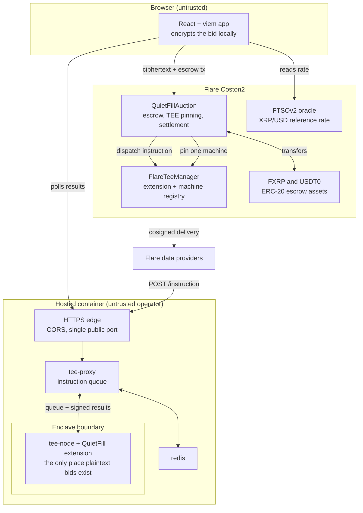
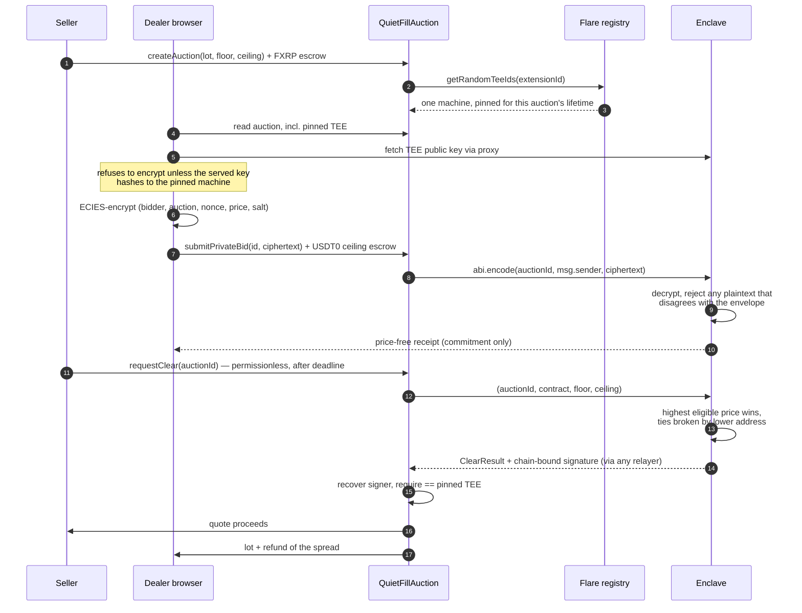
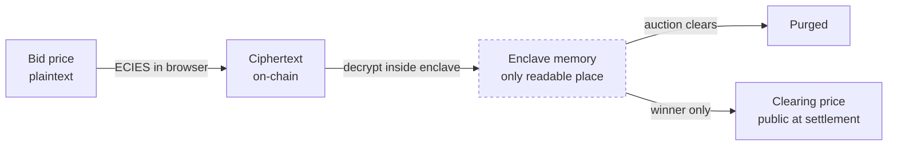
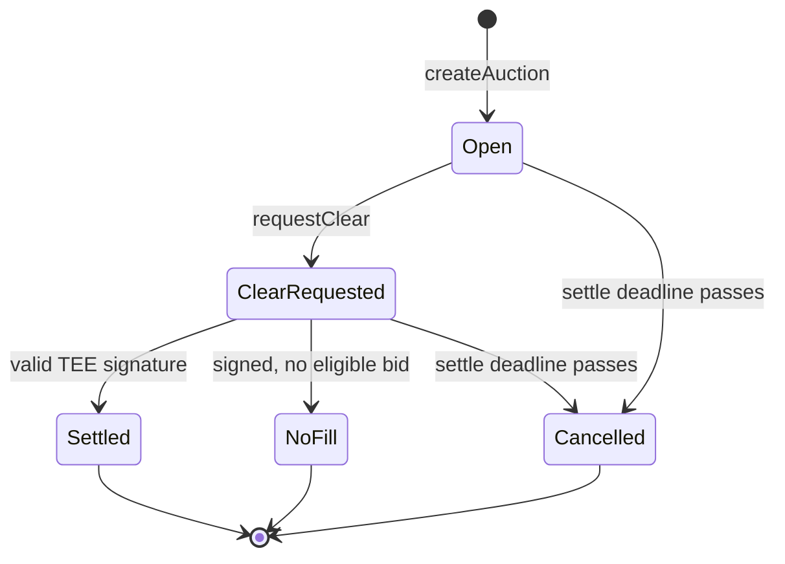

# Architecture

How QuietFill is put together, end to end. The README explains what it does and
why; this explains how, and — more usefully — *where the trust actually sits*.

The whole design answers one question: **how can competing dealers submit
prices that nobody can read, and still have everyone agree on who won?** The
answer is that the winner is chosen inside a hardware enclave, and the contract
will only accept a result carrying that enclave's signature. No operator, no
relayer, and no admin key can substitute for it.

---

## 1. The pieces

The operator of that container is explicitly **not** trusted. They can see
ciphertext, restart processes, and drop traffic — but they cannot read a bid or
forge a settlement, because the decryption key never leaves the enclave and the
contract verifies a signature only the enclave can produce.

---

## 2. One auction, end to end

Two details in there carry most of the security weight:

**The envelope (step 11).** The contract wraps every bid as
`abi.encode(auctionId, msg.sender, ciphertext)`. `msg.sender` is authenticated
by the chain, so the enclave can reject a plaintext claiming to be someone
else's bid. Without this, any escrowed party could overwrite a rival's bid with
a spoofed one, or bind a ciphertext to an auction they never escrowed for.

**The pin (step 2).** The machine is chosen by the registry at creation and
frozen for that auction. Settlement recovers the signer and compares it to that
address, so a result from any other machine — including one the operator
registers later — is rejected.

---

## 3. What is secret, and for how long

- Losing prices are **never** published — not in events, receipts, `/state`, or
  logs — and are deleted from enclave memory the moment the auction clears.
- The winning price becomes public at settlement, because settlement has to move
  exactly that much money.
- `/state` reports no bid counts either, so bid flow is not observable by
  polling the proxy.

**What stays public, deliberately:** that you escrowed, and therefore that you
are participating. Escrow moves ERC-20s, and token transfers are visible on any
chain. QuietFill hides *prices and intent*, not *participation* — and
settlement remains fully auditable, which is the point.

---

## 4. Trust boundaries

| Component | Trusted for | Cannot |
|---|---|---|
| Browser app | Nothing | Read another bid, or influence the winner |
| Relayer | Nothing | Alter, replay, or forge a result |
| Container operator | Availability only | Decrypt a bid or settle an auction |
| Enclave | Clearing correctly | Move funds directly, or settle for another auction |
| Contract | Escrow and verification | Be upgraded, paused, or overridden — it has no owner |

The signature the contract checks is bound to the domain
`TEE_ACTION_RESULT`, `block.chainid`, the clear instruction id, and every field
of the result. A signature is therefore useless on another chain, another
auction, or with a single field altered.

---

## 5. When things break

Liveness is deliberately separated from safety: **no failure path can strand
funds.**

- **Enclave never answers** → after the settle deadline anyone calls
  `cancelTimedOutAuction`; the seller's lot returns and dealers withdraw their
  escrow.
- **No bid inside the collar** → the enclave signs an explicit no-fill; the lot
  goes back.
- **Winner cannot pay** → impossible by construction, since a full ceiling
  escrow is a precondition for winning.

This is demonstrated on-chain rather than asserted — see EVIDENCE.md, where an
auction pinned to a machine that was retired before it could clear returned the
seller's escrow in full.

**The known cost of this design:** pinning one machine per auction means a host
restart, which mints a new enclave identity, strands that auction until its
timeout. Verifying against the *currently active* set at settlement instead
would remove the coupling without weakening the signature check, and is the
main change worth making next.

---

## 6. Repository map

| Path | Role |
|---|---|
| `contracts/InstructionSender.sol` | `QuietFillAuction` — escrow, pinning, signature verification, settlement |
| `typescript/src/app/` | The enclave extension: envelope checks, decryption, clearing |
| `typescript/src/base/` | Wire framework fixed by the FCC container contract |
| `web/` | Seller and dealer app; in-browser ECIES, TEE-key verification, relay |
| `tools/` | Go tooling: deploy, register, and a runner that drives a full auction |
| `deploy/render/` | Single-container deployment of the whole stack |
| `scripts/` | Lifecycle: build, register, health-check, and re-register |

The browser's ECIES is byte-compatible with the enclave's Go implementation;
that equivalence is pinned by a committed fixture so a library change cannot
silently break decryption.
