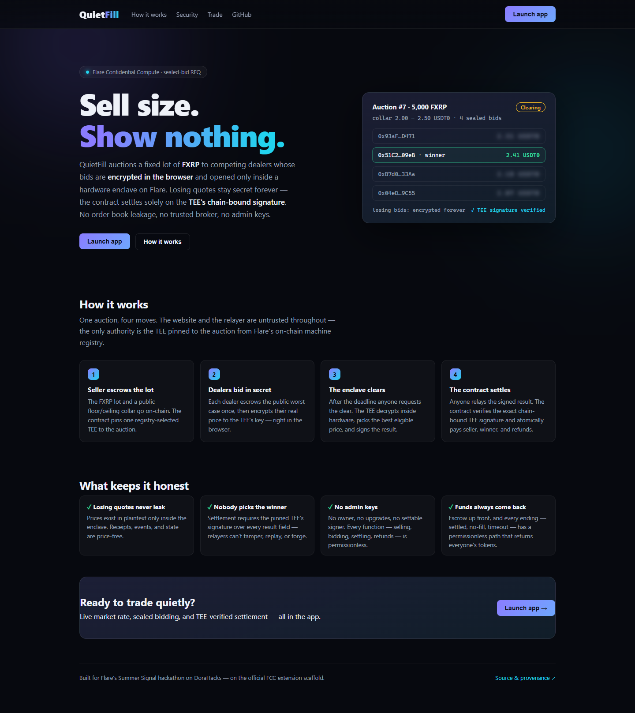
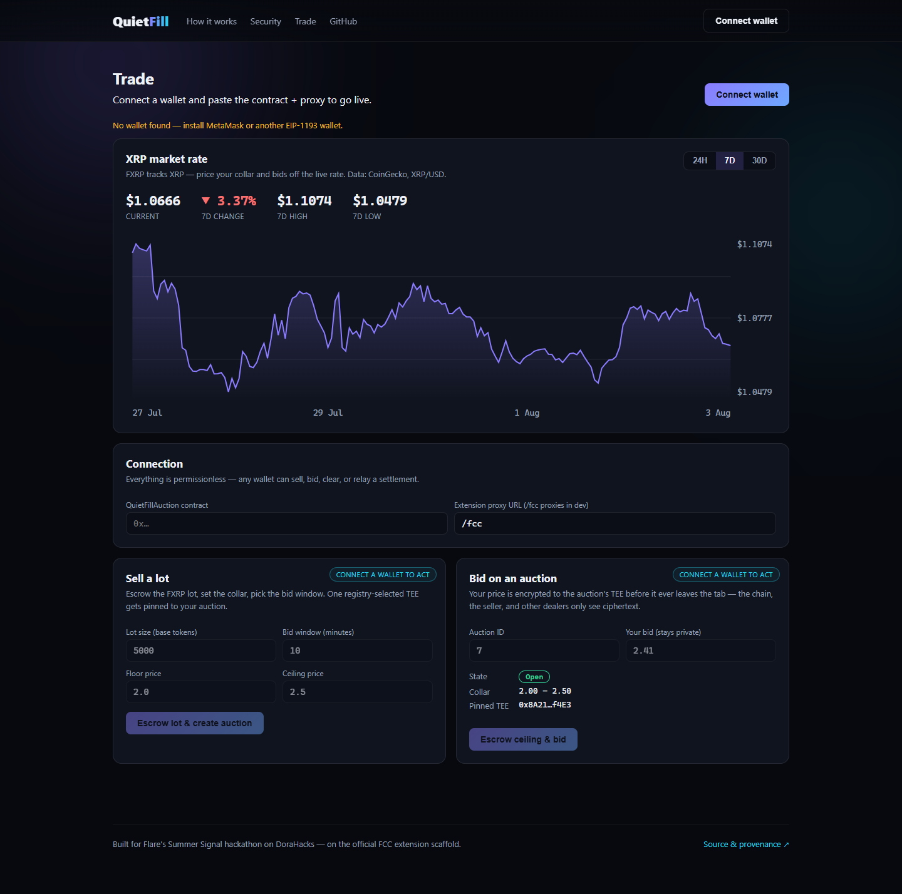

# QuietFill

**Sealed-bid RFQ auctions for FXRP/USDT0 on Flare, cleared inside a TEE.**

QuietFill lets a seller auction a fixed lot of FXRP to competing dealers without ever revealing the losing quotes. Bids are encrypted in the dealer's browser to a TEE selected from Flare's on-chain machine registry, decrypted and compared only inside **Flare Confidential Compute (FCC)**, and settled on-chain against the TEE's chain-bound signature. The contract has no owner and no admin keys — anyone can create an auction, bid, request a clear, relay a settlement, or recover their funds.

Built for Flare's Summer Signal hackathon on DoraHacks, on top of Flare's official FCC extension scaffold ([provenance](#provenance)).



The trade page pairs the live XRP/USD market rate (FXRP tracks XRP) with the sealed-bid panels, so collars and private bids are priced off the real market:



## Why

On a public order book every losing quote is free information: competitors learn your spread, and visible bids invite last-look sniping and front-running. Off-chain RFQ desks solve this with trust — you send your price to a broker and hope. QuietFill replaces that trust with hardware attestation and a signature check:

- **Losing prices are never revealed.** Not on-chain, not in events, not in the extension's `/state`, not in receipts. Only the single clearing price becomes public, at settlement, because settlement needs it.
- **Nobody chooses the winner off-chain.** The browser and the relayer are untrusted. The contract only accepts a `ClearResult` carrying the exact chain-bound signature of the one TEE that was pinned to the auction at creation time — an address the contract read from Flare's TEE machine registry, not from any human.
- **Funds are always recoverable.** Sellers and dealers escrow up front, and every terminal state — settled, no-fill, timeout — has a permissionless path that returns everyone's tokens.

## How it works

```mermaid
sequenceDiagram
  participant S as Seller
  participant D as Dealer (browser)
  participant C as QuietFillAuction contract
  participant T as FCC TEE (QuietFill extension)

  S->>C: createAuction(lot, floor, ceiling) + FXRP escrow
  Note over C: pins one registry-selected TEE to the auction
  D->>C: submitPrivateBid(auctionId, ciphertext) + USDT0 ceiling escrow
  C->>T: instruction: abi.encode(auctionId, msg.sender, ciphertext)
  T->>T: decrypt; reject plaintext that claims another bidder/auction
  Note over D,T: bid prices exist in plaintext only inside the TEE
  D->>C: (optional) replacement bid, higher nonce, same escrow
  S->>C: requestClear(auctionId) — permissionless after bid deadline
  C->>T: instruction: (auctionId, contract, floor, ceiling)
  T->>T: highest eligible price wins, deterministic tie-break
  T-->>C: ClearResult + chain-bound TEE signature (via proxy, any relayer)
  C->>C: verify pinned TEE's signature, escrow, collar → atomic settlement
```

1. **Create.** The seller escrows the FXRP lot and publishes a price collar (floor/ceiling). The contract asks Flare's TEE machine registry for one active TEE running this extension and pins it to the auction.
2. **Bid.** A dealer escrows the public worst-case amount (`lot × ceiling`) once, encrypts `(bidder, contract, auctionId, nonce, price, salt)` to the pinned TEE's public key in the browser, and submits only ciphertext. The contract wraps it as `abi.encode(auctionId, msg.sender, encryptedBid)`, so the TEE can reject any plaintext that lies about who is bidding or where — no dealer can overwrite a competitor's bid or poison another auction. Replacement bids reuse the escrow and must increase the nonce.
3. **Clear.** After the bid deadline anyone may request the clear. The TEE selects the highest bid inside the collar (ties broken by lower address), and returns a `ClearResult` that binds the contract address, auction ID, winner, price, nonce, bid commitment, and bid counts — signed with the tee-node's chain-bound `TEE_ACTION_RESULT` scheme.
4. **Settle.** Anyone relays the signed result. The contract recomputes the exact tee-node digest — `keccak(keccak(data) ‖ instructionId ‖ keccak("threshold") ‖ 0x01)`, wrapped with the domain, `block.chainid`, and EIP-191 — and recovers the signer. Only the pinned TEE's address settles: winner gets the lot, seller gets `lot × clearingPrice`, the winner's spread is refunded, losers pull their full escrow back. If nothing clears in time, `cancelTimedOutAuction` returns everything.

## Security model

| Property | Enforced by |
|---|---|
| Losing quotes stay private forever | Prices never leave the TEE; receipts and `/state` are price-free |
| Relayer cannot tamper with the result | Signature covers every `ClearResult` field plus the clear instruction ID |
| Result cannot be replayed or cross-applied | Digest binds contract address, chain ID, auction, and instruction ID; state machine allows one settlement |
| No bidder can spoof or displace another | TEE trusts only the contract-authenticated envelope `(auctionId, msg.sender)`, never the plaintext's claims |
| Winner can always pay | Full ceiling escrow is a precondition for winning a settlement |
| No admin risk | No owner, no upgradability, no settable signer — the TEE address comes from Flare's registry at auction creation |
| Liveness failure ≠ fund loss | Post-deadline cancellation and pull-based refunds need no TEE |

The signature format deliberately mirrors the scaffold's pinned `tee-node` revision (`31fc839ae6d2`) rather than a generic `signMessage`; see [CLAUDE.md](CLAUDE.md) for the exact derivation.

## Repository layout

| Path | What it is |
|---|---|
| [contracts/InstructionSender.sol](contracts/InstructionSender.sol) | `QuietFillAuction` — escrow, TEE pinning, signature verification, settlement |
| [typescript/src/app/](typescript/src/app/) | The FCC extension: envelope + bid decryption, monotonic nonces, deterministic clearing |
| [test/QuietFillAuction.t.sol](test/QuietFillAuction.t.sol) | Foundry suite: settlement, forged/tampered/replayed signatures, unescrowed winner, no-fill, timeout, envelope binding |
| [typescript/src/__tests__/](typescript/src/__tests__/) | Extension suite: privacy of `/state`, spoofing rejection, collar filtering, tie-breaks, wire shape |
| [tools/](tools/) | Go tooling: verified deploy, register extension/TEE, and a runner that drives one real auction end to end |
| [web/](web/) | Seller/dealer app (React + viem): in-browser ECIES bid encryption, TEE-key verification, signed-result relay |
| [docs/](docs/) | Scaffold documentation (wire contract, extension guide, testing) |

## Run the tests

```bash
forge test                                    # 11 contract tests
cd typescript && npm ci && npm test           # 35 extension tests
cd ../web && npm ci && npm test               # 6 crypto tests, incl. a tee-node ECIES fixture
```

## Status

- ✅ Auction contract with TEE-signature settlement — tested
- ✅ TypeScript FCC extension with authenticated bid envelopes — tested
- ✅ Deployment tooling: verified Coston2 deploy + a runner that drives one real auction end to end
- ✅ Seller/dealer web app — bid encryption byte-checked against the pinned tee-node revision
- 🔜 Live Coston2 deployment with hosted FCC proxy

## Provenance

This repository intentionally keeps the full history of Flare's official [`fce-extension-scaffold`](https://gitlab.com/flarenetwork/tee) — the FCC "Hello World" it grew from. Everything QuietFill starts at commit `d719b2e` (hackathon work). The scaffold's own README, with instructions for running extensions in Go/Python/TypeScript against local or Coston2 infrastructure, lives at [docs/scaffold-readme.md](docs/scaffold-readme.md).
